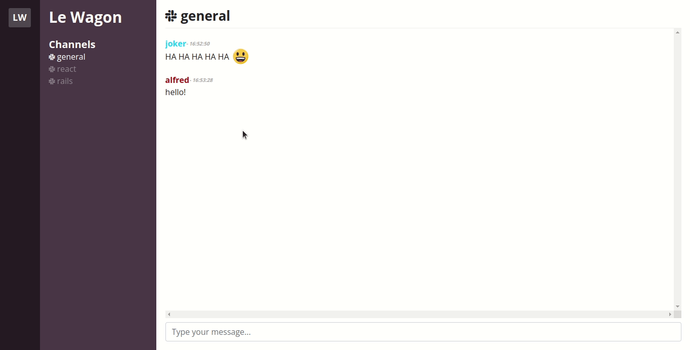

# Slack Copycat With React & Redux

## A copy of slack chat:


## Created with Le Wagon [redux-boilerplate](https://github.com/lewagon/redux-boilerplate) using with the following config:

- React, ReactDOM
- Redux, React-Redux
- Webpack 3
- Babel with es2015 and react presets
- Bootstrap (css only, loaded from a cdn in `index.html`)
- work with `.js` or `.jsx` files
- main `application.scss` stylesheet is imported in `index.js` as a module to enjoy hot reloading

### Script

To start the local Webpack Dev Server (usually on port `8080`):

```bash
yarn start
```

## You can see it live [here](https://millenevprado.github.io/slack-redux/)
